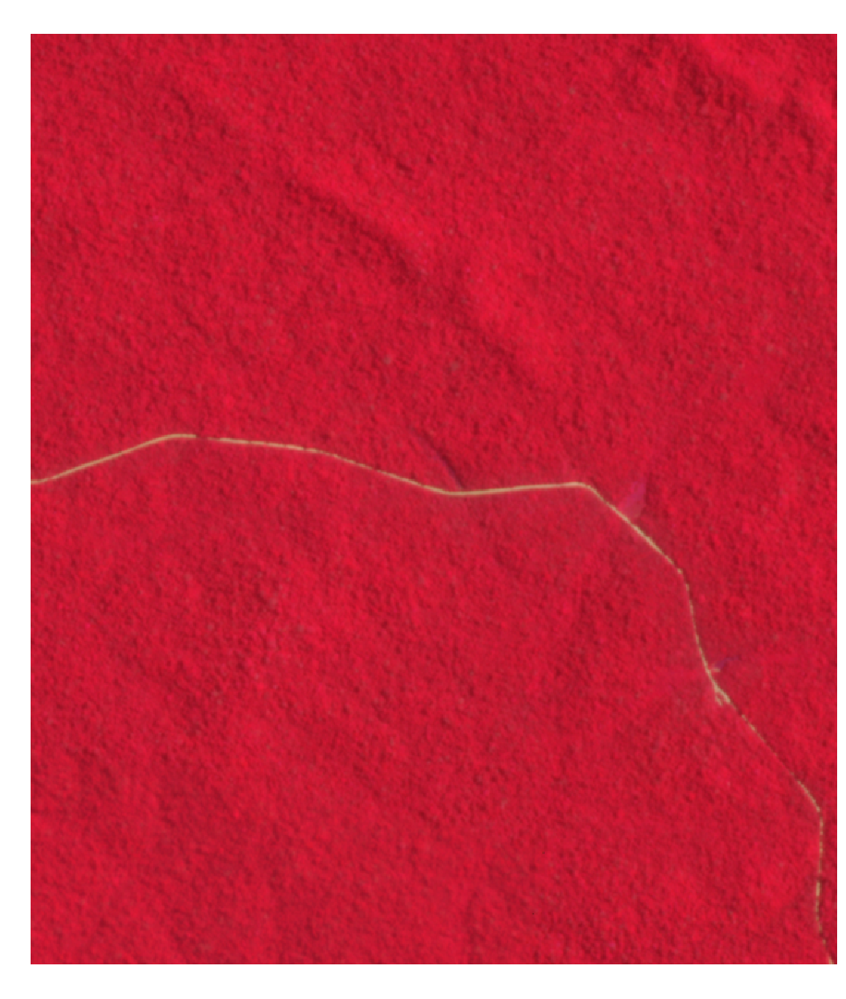
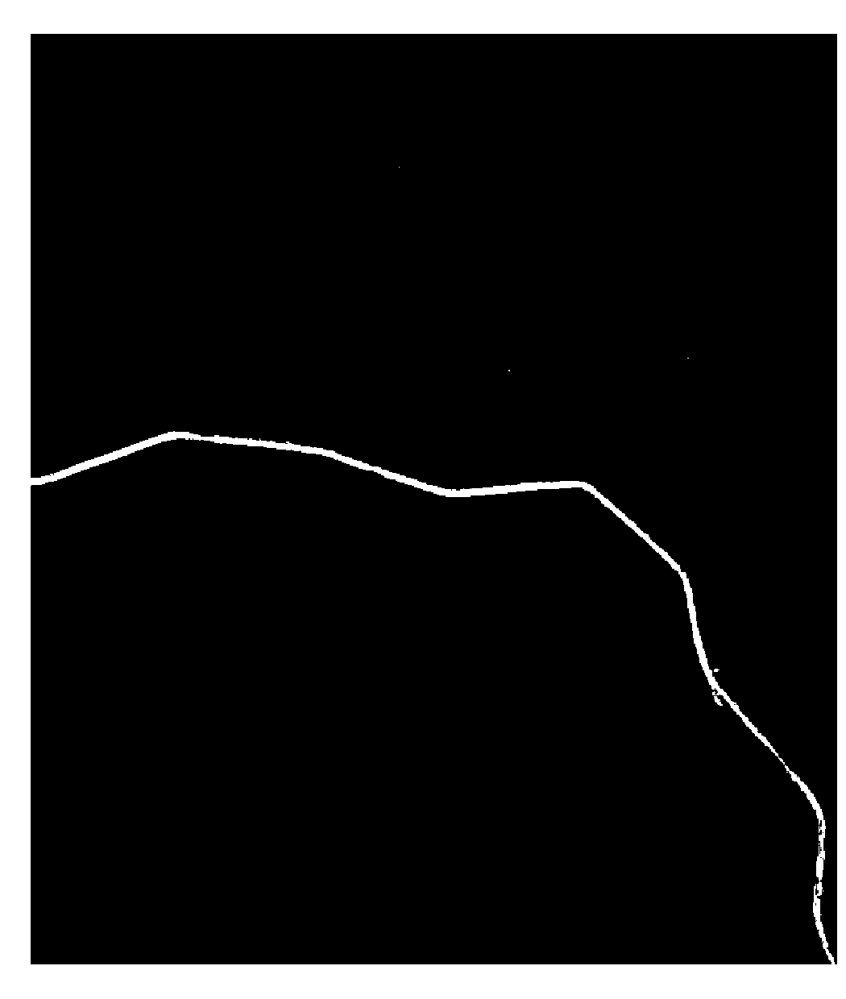

# Road detection using Sat2Graph and creating dataset
These scripts are described in the paper, "Importance of road detection for evaluating deforestation distribution 
in Brazilian Amazon using satellite imagery"(Japanese),presented in The 76th Conference (2024 Spring Conference) of the Remote Sensing Society of Japan.

### \<Overview\>
Creating dataset outputs a csv format that the total area of deforestation, or deforestation or not of DETER(http://www.obt.inpe.br/OBT/assuntos/programas/amazonia/deter/deter) for each 1 km mesh of the target area per month within a period of data, by inputting the north-south latitude and east-west longitude of the target area and the DETER shapefile.


Modified Sat2Graph codes to use NICFI Planet data and to add location information. Sat2Graph is one of the road detection method using deep learning. Original Sat2Graph codes are https://github.com/songtaohe/Sat2Graph by Dr. He. Using these scripts, downloading Planet nicfi data, training, detecting road and postprocessing.

 <br/>
         Left: Planet NICFI imagery Right: Road detection</br>
This satellite imagery was used under the NICFI Satellite Data Program.

### \<Environments\>
To execute creating dataset code,the following modules must be installed in an environment.<br/>
- fiona<br/>
- geopandas<br/>
- numpy<br/>
- pandas<br/>

You can create environment using env.yml by<br/>
```conda env create -f env.yml```<br/>

To execute modified Sat2Graph codes, the following modules must be installed in an environment.<br/>
- geopandas<br/>
- imageio<br/>
- numpy<br/>
- opencv-python<br/>
- pandas<br/>
- rasterio<br/>
- rtree<br/>
- scipy<br/>
- shapely<br/>
- svgwrite<br/>
- tensorflow<br/>
- tflearn


### \<Execute Codes\>
### 1.Creating dataset
1.1 Setting of code<br/>
In code, input "ID". Assign a unique ID to each target area. For existing target areas, "Porto Velho" is 1, "Humaita" is 2, "Altamira" is 3, "Vista Alegre do Abuna" is 4, "Novo Progresso" is 5, "Sao_Felix_do_Xingu" is 6, "S6W57 " is 7 and "S7W57" is 8. New target areas will be assigned in order starting from 9. <br/>

In code, input "west","east","north" and "south" by the north-south latitude and east-west longitude of the target area. The latitude and longitude of the existing target area are commented out. Input the west longitude and south latitude in negative numbers.<br/>

1.2 Execution of code<br/>
Execution of code as below (in Anaconda in windows 10)<br/>
```python create_dataset.py```<br/>

1.3 Output results<br/>
2 csv files of deforestation.csv and deforestation_area.csv are created. In addition, 2 geojson files of 1km_mesh.geojson and 1km_mesh_deforestation_area.geojson are created.<br/>
<br/>
### 2. Road detection using Sat2Graph
2.1. Download the training dataset<br/>
The NICFI satellite images of the target area and the road data from the OpenStreetMap are available as the training dataset on this fode. To download them, create a json file under road_detection/prepare_dataset/config directory that describes the target area.<br/>
The json file is described as the following example.<br/>

```[{"lat":-7.6,"lon":-57.39, "lat_n":55, "lon_n":70 }]```<br/>

Here, "lat" and "lon" is the lower left coordinate of the target area. "lat_n" and "lon_n" are the number of tiles in the latitudinal and longitudinal directions, respectively.<br/>

The API Key is obtained by Plaent NICFI page (https://www.planet.com/nicfi/#sign-up).<br/>

To download the training dataset, use download_osm_nicfi.py under the "prepare_dataset" folder and execute it with the json file created above as an argument.<br/>

```python download_osm_nicfi.py [target_date] [API_key]  path/to/json_file```<br/>
<br/>
For [target_date], enter the start year and month of the NICFI satellite image you want to acquire in YYYY-MM format (YYYY: year, MM: month)<br/>
<br/>
2.2 Training<br/>
To execute training, use train_Brazil.py under the folder of "model".<br/>
Create "df_valid.csv" containing use/non-use of the training data as follows.<br/>
<br/>
ID,valid<br>
0,1<br>
1,0<br>
2,0<br>
3,1<br>
4,0<br>
5,1<br>
<br>
In "valid" column, set "1" for the image pair used as training data, and set "0" for the rest.<br>
<nr>
Set the path of "osmdataset" and "df_valid" in train_Brazil.py. Execute it.<br/>

```python3 train_Brazil.py -model_save [prefix_of_model_folder] -instance_id test -image_size 352```<br/>
<br/>
The model is saved in the [prefix_of_model_folder]test_352_8__channel12 folder.<br/>
<br/>
2.3 Download NICFI image<br/>
To download of the NICFI image for road detection, use download_nicfi_target.py under the folder "prepare_dataset".<br/>
 In the case of downloading them, create a json file that describes the target area.<br/>
Describe the json file as shown below in the example of Altamira.<br/>

```[{"lat":-3,"lon":-52, "lat_n":12, "lon_n":12 }]```<br/>
<br/>
Here, "lat" and "lon" is the lower left coordinate of the target area. "lat_n" and "lon_n" are the number of tiles in the latitudinal and longitudinal directions, respectively.<br/>
<br/>
Download the NICFI image using download_nicfi_target.py as follows.<br/>
```python download_nicfi_target.py  [target_date] [start date] [start_ID] [API_key]   path/to/json_file```<br/>
<br/>
For [target_date], enter the start year and month of the NICFI satellite image you want to acquire in YYYY-MM format (YYYY: year, MM: month) (for example, September 2022, then 2022-09). From June 2016 to May 2020, it is calculated in 6-month units (for example, from June 2016 to November 2016, then 2016-06_2016-11), and from June 2020 to August 2020, it is calculated in 3-month units (for example,2020-06_2020-08), and from September 2020 onwards, it is in monthly units (for example, 2020-09 for September 2020). <br/>
For [start date], enter the start year and month in YYYYMM format (for example, September 2022, then 202209).<br/>
For [API_key], enter the API KEY obtained from the NICFI web page.<br/>
For [start_ID], enter the unique number in each target area in units of 10000. 10000 is assigned to Porto Velho, 20000 is assigned to Humaita, 30000 is assigned to Alamira, 40000 is assigned to Vista Alegre do Abuna, 50000 is assigned to Novo Progresso, 60000 is assigned to Sao Felix do Xingu,70000 is assigned to S6W57,and 80000 is assigned to S7W57. When adding new target area in the future, add 90000, 100000, 110000 and so on.<br/>
<br/>
The downloaded NICFI data are saved in png format with the name region_[ID]_sat.png in the folder "nicfi_dataset".<br/>
<br/>
2.4 Road Detection<br/>
Execute road detection for the downloaded NICFI data by the trained model.<br/>
Using test_Brazil_target_area.py under the model folder, execute the created model with the dataset downloaded in 2.3 and the mesh polygon json file as arguments, as follows.<br/>
```python test_Brazil_target_area.py -instance_id test -image_size 352 -model_recover path/to/model -mode test -dataset path/to/dataset -mesh_polygon path/to/geojson```<br/>
<br/>
For example, in the case of model is "model300000" in "model_tmptest_352_8__channel12 "folder, dataset is in "nicfi_dataset" folder, and geojson format mesh polygon file is in "polygon_data/polygon".json, then execute with Python 3 as follows.<br/>
```python test_Brazil_target_area.py -instance_id test -image_size 352 -model_recover model_tmptest_352_8__channel12/model300000 -mode test -dataset nicfi_dataset  -mesh_polygon polygon_data/polygon.json```<br/>
<br/>
Detected roads are saved as image file named [ID]_output_keypoints.tif under the folder "outputs". The pixel value of the output image indicates the probability of the road rescaled from 0 to 255. NICFI satellite images are also saved as [ID]_sat.tif under the same folder.<br/>
<br/>
2.5 Mosaicking and Converting map projection<br/>
The road data detected by "2.4 Road Detection" is divided into multiple tiles with the same date. Therefore, mosaicking them into one road data image file for the target area. The map coordinate of this data is geographic latitude and longitude with WGS84 reference system. In this case, the distance per degree of longitude varies depending on the latitude, so it is difficult to measure the distance from the road. Therefore, the map coordinate is converted to the UTM map projection in mosaicking process.
Use rasterio_merge_warp.py　under the folder "postprocessing". The target areas are Porto Velho, Humaita, Altamira, Vista Alegre do Abuna, Novo Progresso, Sao Felix do Xingu, S6W57 and S7W57 and their codes start with 10000, 20000, 30000, 40000, 50000, 60000, 70000 and 80000 respectively.<br/>
Set rasterio_merge_warp.py as follows.<br/>
<br/>
 In " target_list ", set the target area and number. In this case, 'Porto_Velho_10000', 'Humaita_20000', 'Altamira_30000', 'Vista_Alegre_do_Abuna_40000', 'Novo_Progresso_50000', 'Sao_Felix_do_Xingu_60000', 'S6W57_70000', and 'S7W57_80000' respectively.
 In "data", set the list of target years and months used for road detection in YYYYMM format (YYYY: year, MM: month). (Example: ['202208','202209'] for August 2022 and September 2022)<br/>
 In "inputpath", set the folder where road detection results are located.<br/>

<br/>
As executed with Python in below, it is created the mosaicked road data for specified a year and month for each target area in the UTM map projection in GeoTIFF format.<br/>
```python rasterio_merge_warp.py```<br/>
<br/>
2.6 Binarization of Road Data<br/>
Road data projected in the UTM map coordinate is an image containing road probabilities scaled from 0 to 255 in each pixel. They are binarized into road pixels and non-road pixels.<br/>
Use rasterio_calc_over30.py under the folder "postprocessing" for this processing. Set parameters in rasterio_calc_over30.py as follows.<br/>
<br/>
 In "threshold", set the threshold. The default is 30.<br/>
 In "target_list", set the target area and number. In this case, 'Porto_Velho_10000', 'Humaita_20000', 'Altamira_30000', 'Vista_Alegre_do_Abuna_40000', 'Novo_Progresso_50000', 'Sao_Felix_do_Xingu_60000', 'S6W57_70000', and 'S7W57_80000' respectively.<br/>
 In "inputpath", set the folder where the files after converting map coodinate system.<br/>
 In "outputpath", set the the folder where the binarized files of the road are located.<br/>


As executed with Python as follows, it is created the binarized road data in Geotiff format.<br/>
```python rasterio_calc_over30.py```<br/>
<br/>
2.7 Remove falsely detected road pixels<br/>
Once a new road is built, it is unlikely to change to non-roads, and it is assumed that it will continue to be road. Therefore, using three images, image (t) of the time period of road detection, image (t+1) of the following time period, and image (t+2) of the next following time period, if a pixel detected as a road in image (t) is not detected as a road in both images (t+1) and (t+2), then the pixel detected as a road in image (t) is determined to be a false positive and is considered to be a non-road pixel. If there is no image in the following two periods, the above process is not performed.<br/>
This process is performed by rasterio_removal_fault_roads.py using Python.Set rasterio_removal_fault_roads.py as follows:<br/>
<br/>
 In "inputpath", set the folder where the detected road data are located.<br/>
 In "outputpath", set the folder where the road data with the removed road pixels that are considered to be false positives are located.<br/>
 In "filename", set the file name of the detected road data (GeoTIFF format) excluding the date (e.g., "Porto_Velho_road.tif" for 202207Porto_Velho_road.tif).<br/>
 In "target", set the target area name.<br/>
 In "data", set the list of target years and months selected in YYYYMM format(YYYY: year, MM: month).<br/>
<br/>
As executed with Python as follows, it is exported the road data in GeoTIFF format removed falsely detected road pixels.<br/>
```python rasterio_removal_fault_roads.py```<br/>

2.8 Remove small falsely detected road<br/>
Even if road pixels that are considered to be falsely detected are removed, small portion of falsely detected roads may remain. It is necessary to remove small falsely detected roads because they may affect deforestation predictions. <br/>
Therefore, a group of consecutive road pixels called a region group is created, and a process is performed to remove consecutive groups of road pixels that are less than the threshold value. In this case, the threshold value is 150 while referring to the NICFI images and road detection images.<br/>
This process is performed by rasterio_clump.py. For this purpose, rasterio, numpy, scipy and pandas modules need to be installed. Set rasterio_clump.py as follows.<br/>
<br/>
 In "inputpath", set the folder where the road data removed falsely detected are located.<br/>
 In "outputpath", set the folder where the removed small falsely detected road data are located.<br/>
 In "target", set the target area.<br/>
 In "th", set the threshold value (In this case:150).<br/>
 In "data", set the list of target years and months selected in YYYYMM format(YYYY: year, MM: month).<br/>
As executed with Python as follows, it is exported the road data in GeoTIFF format removed small falsely detected roads.<br/>
```python rasterio_clump.py```<br/>

2.9 Creation of cumulative roads<br/>
As described above, once a new road is built, it is unlikely to change to non-roads, and it is assumed that it will continue to be road. Therefore, the pixels detected as roads in 2.8 are assumed to be roads in all periods after the relevant period. This process is performed by rasterio_road_cumulation.py using Python. Set rasterio_road_cumulation.py as follows.<br/>
<br/>
 In "inputpath", set the folder used for output in "2.8 Remove small falsely detected road".<br/>
 In "outputpath", set the folder where the accumulated road data are located.<br/>
 In "target", set the target area.<br/>
 In "data", set the list of target years and months selected in YYYYMM format(YYYY: year, MM: month).<br/>
<br/>
As executed with Python as follows, it is exported the accumulated road data in GeoTIFF format.<br/>
```python rasterio_road_cumulation.py```<br/>
<br/>
2.10 Remove falsely detected road manually<br/>
Not all falsely detected roads are removed,therefore, polygons are created to remove remaining falsely roads.<br/>
The falsely detected roads are removed using the created false-road shapefile manually and the cumulative road images. This process is performed by rasterio_road_error_removal.py using Python. Set rasterio_road_error_removal.py as follows.<br/>
<br/>
 In "inputpath", set the path where the cumulative road images are located.<br/>
 In "outputpath", set the path where the output road data is exported.<br/>
 In "remove_area_path", set the path where the created shapefile is located.<br/>
 In "target", set the target area.<br/>
 In "data", set the list of target years and months selected in YYYYMM format(YYYY: year, MM: month).<br/>
<br/>
As executed with Python in below, it is created the road data in GeoTIFF format which is removed falsely detected road manually.<br/>
```python rasterio_road_error_removal.py```<br/>
<br/>
2.11 Calculation of the shortest distance from the centroid of each 1km mesh to the road<br/>
Based on the raster data from which roads are detected at each time period, the shortest distance from the centroid of the 1km mesh to the road is calculated. <br/>
<br/>
This process is performed by rasterio_compute_proximity.py using Python. Set rasterio_compute_proximity.py as follows.<br/>
<br/>
 In "inputpath", set the folder used for output in "2.10 Remove falsely detected road manually".<br/>
 In "outputpath", set the folder where the data of the shortest distance from each pixel to the road are located.<br/>
 In "outputfilename", set the file name after the date and target area (e.g., "road_proximity" for "202207Porto_Velho_road_proximity.tif").<br/>
 In "target", set the target area.<br/>
 In "data", set the list of target years and months selected in YYYYMM format(YYYY: year, MM: month).<br/>
<br/>
As executed with Python as follows, it is exported the shortest distance data from each pixel in the raster to the road in GeoTIFF format.<br/>
```python rasterio_compute_proximity.py```<br/>
<br/>
Then, the shortest distance from the centroids of each 1 km mesh to the road is calculated based on the shortest distance data from each pixel to the road.<br/>
This process is performed by rasterio_extract_point_value.py. For this purpose, pandas, geopandas and rasterio modules need to be installed.<br/>
Set rasterio_extract_point_value.py in below: <br/>
<br/>
 In "inputpath", set the folder where the data of the shortest distance from each pixel to the road is located. <br/>
 In "mesh_centroid", set the path where the point GIS data of the centroid is located. <br/>
 In "outputpath", set the path where the shortest distance from the centroid of each 1km mesh to the road is exported.<br/>
 In "data", set the list of target years and months selected in YYYYMM format(YYYY: year, MM: month).<br/>
<br/>
As executed with Python as follows, the shortest distance from the centroid to the road file for each 1 km mesh is created.<br/>
```python rasterio_extract_point_value.py```<br/>
<br/>
2.12 Creation of monthly data<br/>
NICFI satellite imagery is a composite of 6-month units from June 2016 to May 2020, 3-month units from June 2020 to August 2020, and 1-month units from September 2020 onward. Therefore, the data in 6-month and 3-month units are converted into 1-month unit by filling the same value into each month of the relevant period.<br/>
This process is performed by road_Brazil_per_month.py. For this purpose, pandas module needs to be installed.Set road_Brazil_per_month.py as follows. <br/>
<br/>
 In "target_area_list", set the target area as list.<br/>
 In "main_dir", set the path where the file calculating the shortest distance from the centroid of each 1km mesh to the road area is located.<br/>
 In "startyear", set the start year of the period for which data is created.<br/>
 In "startmonth", set the start month of the period for which data is created.<br/>
 In "endyear", set the end year of the period for which data is created.<br/>
 In "endmonth", set the end month of the period for which data is created.<br/>
<br/>
As executed with Python in below, it is created a monthly datasets.<br/>
```python road_Brazil_per_month.py```<br/>

2.13 Change to within 5km or not and in 1km unit<br/>
If you want to change the data to within 5 km or not and 1 km units (rounded up), use road_5km_threshold_1km_unit.py. If you want to change the 5km threshold, you can create it by changing this script. Set road_5km_threshold_1km_unit.py as follows.<br/>
<br/>
 In "target_area_list", set the target area as list.<br/>
 In "main_dir", set the folder path where monthly data is located.<br/>
 In "data", set the list of target years and months selected in YYYYMM format(YYYY: year, MM: month)<br/>
<br/>
As executed with Python as follows, it is exported the files within 5km or not, and in 1km unit.<br/>
```python road_5km_threshold_1km_unit.py```<br/>

### \<Acknowledgements\>
Sat2Graph and its codes are created by Dr. He.
